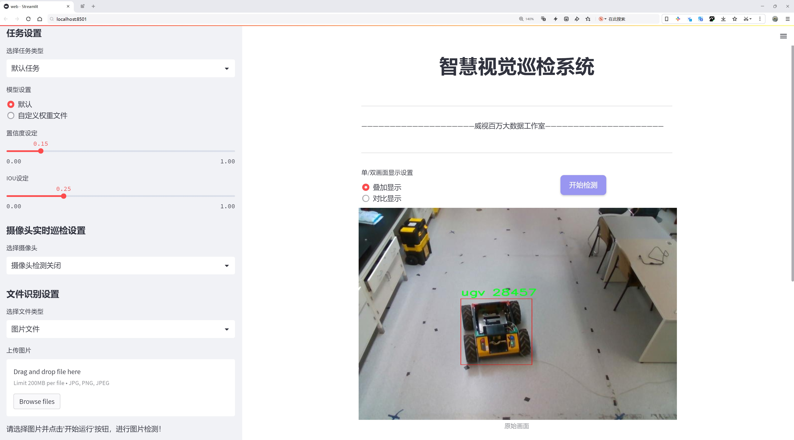
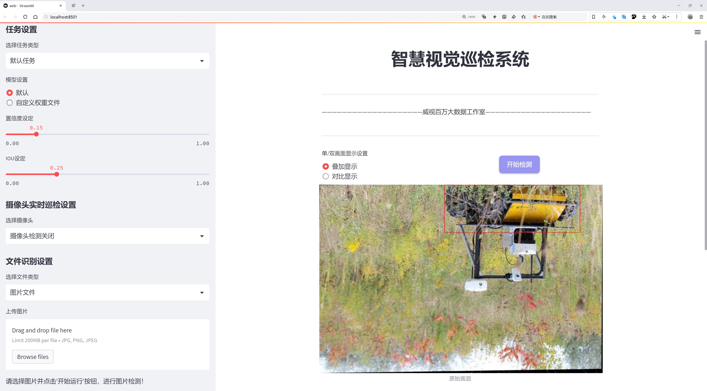
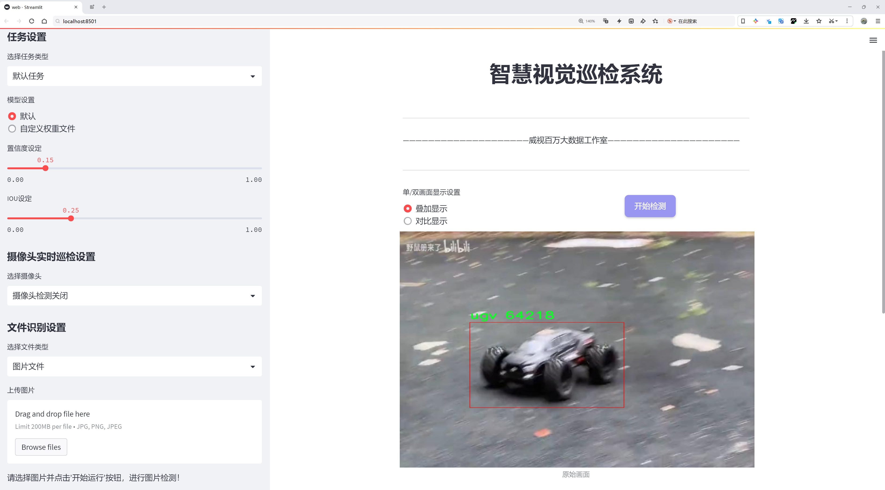
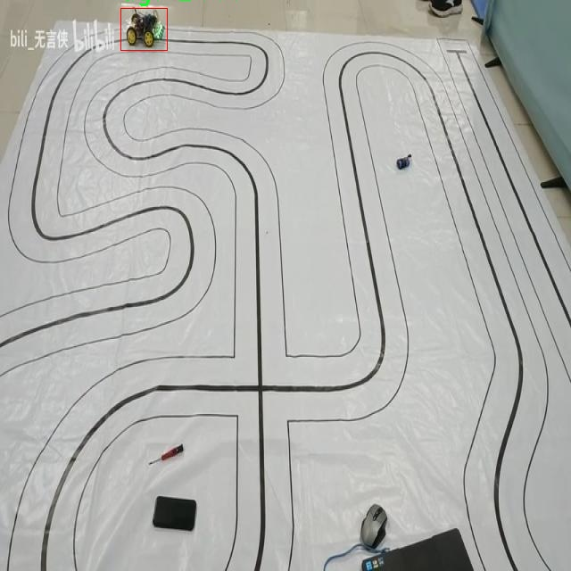
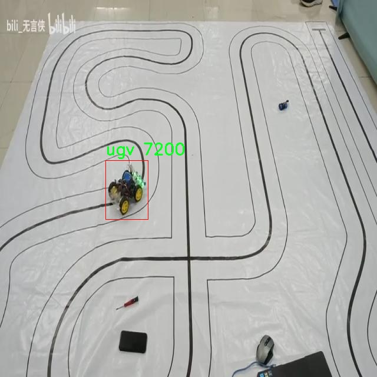
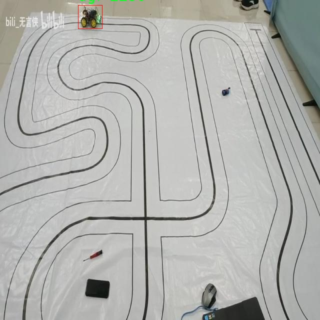
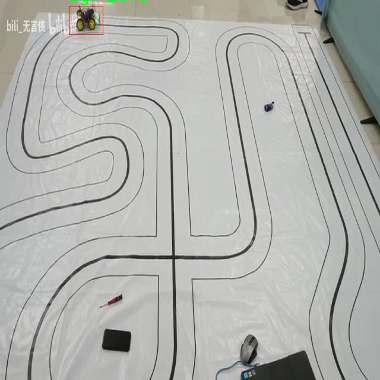

# 小型无人地面车辆检测检测系统源码分享
 # [一条龙教学YOLOV8标注好的数据集一键训练_70+全套改进创新点发刊_Web前端展示]

### 1.研究背景与意义

项目参考[AAAI Association for the Advancement of Artificial Intelligence](https://gitee.com/qunmasj/projects)

项目来源[AACV Association for the Advancement of Computer Vision](https://kdocs.cn/l/cszuIiCKVNis)

研究背景与意义

随着无人驾驶技术的迅速发展，小型无人地面车辆（UGV）在军事、农业、物流和城市管理等多个领域的应用愈加广泛。小型无人地面车辆因其灵活性和高效性，能够在复杂环境中执行各种任务，如巡逻、监测、运输等。因此，如何高效、准确地检测和识别这些小型无人地面车辆，成为了智能交通和自动化领域的重要研究课题。现有的检测技术虽然在某些场景下表现良好，但在小型无人地面车辆的检测上仍然面临诸多挑战，如环境复杂性、车辆多样性以及实时性要求等。

YOLO（You Only Look Once）系列模型因其高效的实时检测能力而受到广泛关注。特别是YOLOv8，作为该系列的最新版本，进一步提升了检测精度和速度，适用于各种物体检测任务。然而，针对小型无人地面车辆的特定需求，YOLOv8的标准模型可能无法完全满足实际应用的要求。因此，基于改进YOLOv8的小型无人地面车辆检测系统的研究，具有重要的理论和实践意义。

本研究将基于一个包含5000张图像的数据集，专注于小型无人地面车辆的检测。该数据集仅包含一个类别的对象，即小型无人地面车辆，这为模型的训练和评估提供了良好的基础。通过对数据集的深入分析和处理，可以有效提高模型对小型无人地面车辆的识别能力。研究将探讨如何通过数据增强、特征提取和模型优化等手段，提升YOLOv8在特定场景下的检测性能，确保其在复杂环境中的稳定性和准确性。

此外，随着智能城市和自动化技术的不断推进，小型无人地面车辆的应用场景日益增多，相关的检测系统需求也随之增加。基于改进YOLOv8的小型无人地面车辆检测系统，不仅能够为相关行业提供高效的技术支持，还能够为后续的研究和应用提供重要的参考依据。通过本研究，期望能够为小型无人地面车辆的智能识别和自主导航提供更加可靠的解决方案，推动无人驾驶技术的进一步发展。

综上所述，基于改进YOLOv8的小型无人地面车辆检测系统的研究，不仅具有重要的学术价值，也为实际应用提供了切实可行的技术路径。通过对小型无人地面车辆的高效检测，能够有效提升相关领域的自动化水平，促进智能交通和无人驾驶技术的融合发展，具有广泛的社会和经济意义。

### 2.图片演示







##### 注意：由于此博客编辑较早，上面“2.图片演示”和“3.视频演示”展示的系统图片或者视频可能为老版本，新版本在老版本的基础上升级如下：（实际效果以升级的新版本为准）

  （1）适配了YOLOV8的“目标检测”模型和“实例分割”模型，通过加载相应的权重（.pt）文件即可自适应加载模型。

  （2）支持“图片识别”、“视频识别”、“摄像头实时识别”三种识别模式。

  （3）支持“图片识别”、“视频识别”、“摄像头实时识别”三种识别结果保存导出，解决手动导出（容易卡顿出现爆内存）存在的问题，识别完自动保存结果并导出到tempDir中。

  （4）支持Web前端系统中的标题、背景图等自定义修改，后面提供修改教程。

  另外本项目提供训练的数据集和训练教程,暂不提供权重文件（best.pt）,需要您按照教程进行训练后实现图片演示和Web前端界面演示的效果。

### 3.视频演示

[3.1 视频演示](https://www.bilibili.com/video/BV1wwsvedEqQ/)

### 4.数据集信息展示

##### 4.1 本项目数据集详细数据（类别数＆类别名）

nc: 1
names: ['ugv']


##### 4.2 本项目数据集信息介绍

数据集信息展示

在本研究中，我们采用了名为“Small UGV detection”的数据集，以支持改进YOLOv8的小型无人地面车辆（UGV）检测系统的训练与评估。该数据集专门针对小型无人地面车辆的识别与定位任务而设计，具有独特的应用价值和研究意义。数据集的类别数量为1，主要类别为“ugv”，这表明该数据集的重点是对小型无人地面车辆的全面捕捉与分析。

“Small UGV detection”数据集的构建过程经过精心设计，旨在提供丰富且多样化的样本，以提高模型在实际应用中的鲁棒性和准确性。数据集中包含了多种场景下的小型无人地面车辆图像，这些图像不仅涵盖了不同的环境条件，如城市街道、乡村道路、室内场所等，还考虑了不同的光照和天气条件。这种多样性使得数据集能够有效地模拟现实世界中小型无人地面车辆的各种可能出现的情况，从而增强模型的泛化能力。

在数据标注方面，数据集采用了高标准的标注流程，确保每一张图像中的小型无人地面车辆都被准确标识。标注不仅包括车辆的边界框信息，还可能涵盖车辆的姿态、尺寸等额外信息，这为后续的模型训练提供了更为详尽的特征数据。通过这样的标注策略，研究人员能够深入分析小型无人地面车辆在不同场景中的表现，进而优化检测算法。

为了提升模型的训练效果，数据集还采用了数据增强技术。这些技术包括图像旋转、缩放、裁剪、颜色变换等，旨在增加训练样本的多样性，减少模型对特定样本的过拟合现象。通过这种方式，模型能够更好地学习到小型无人地面车辆的特征，进而提高其在复杂环境中的检测能力。

在训练过程中，我们将“Small UGV detection”数据集与改进后的YOLOv8模型相结合，利用其先进的特征提取和检测能力，进行高效的训练与优化。YOLOv8作为一种高效的目标检测算法，能够在保持较高检测精度的同时，实现快速的推理速度，适合实时应用场景。通过对该数据集的深入分析与训练，我们期望能够显著提升小型无人地面车辆的检测性能，为未来的智能交通、无人驾驶等领域提供更为可靠的技术支持。

总之，“Small UGV detection”数据集为本研究提供了坚实的基础，助力我们在小型无人地面车辆检测领域的探索与创新。通过充分利用该数据集的丰富信息，我们希望能够推动相关技术的发展，为实现更加智能化的无人地面车辆应用奠定基础。










### 5.全套项目环境部署视频教程（零基础手把手教学）

[5.1 环境部署教程链接（零基础手把手教学）](https://www.ixigua.com/7404473917358506534?logTag=c807d0cbc21c0ef59de5)


[5.2 安装Python虚拟环境创建和依赖库安装视频教程链接（零基础手把手教学）](https://www.ixigua.com/7404474678003106304?logTag=1f1041108cd1f708b01a)

### 6.手把手YOLOV8训练视频教程（零基础小白有手就能学会）

[6.1 手把手YOLOV8训练视频教程（零基础小白有手就能学会）](https://www.ixigua.com/7404477157818401292?logTag=d31a2dfd1983c9668658)

### 7.70+种全套YOLOV8创新点代码加载调参视频教程（一键加载写好的改进模型的配置文件）

[7.1 70+种全套YOLOV8创新点代码加载调参视频教程（一键加载写好的改进模型的配置文件）](https://www.ixigua.com/7404478314661806627?logTag=29066f8288e3f4eea3a4)

### 8.70+种全套YOLOV8创新点原理讲解（非科班也可以轻松写刊发刊，V10版本正在科研待更新）

由于篇幅限制，每个创新点的具体原理讲解就不一一展开，具体见下列网址中的创新点对应子项目的技术原理博客网址【Blog】：


[8.1 70+种全套YOLOV8创新点原理讲解链接](https://gitee.com/qunmasj/good)

### 9.系统功能展示（检测对象为举例，实际内容以本项目数据集为准）

图9.1.系统支持检测结果表格显示

  图9.2.系统支持置信度和IOU阈值手动调节

  图9.3.系统支持自定义加载权重文件best.pt(需要你通过步骤5中训练获得)

  图9.4.系统支持摄像头实时识别

  图9.5.系统支持图片识别

  图9.6.系统支持视频识别

  图9.7.系统支持识别结果文件自动保存

  图9.8.系统支持Excel导出检测结果数据


### 10.原始YOLOV8算法原理

原始YOLOv8算法原理

YOLO（You Only Look Once）系列算法自2015年首次提出以来，经历了多个版本的迭代，逐步演化为如今的YOLOv8。作为最新的版本，YOLOv8在目标检测领域展现了卓越的性能，其设计理念和架构创新使其在速度和精度上都达到了新的高度。YOLOv8的成功，源于其精心设计的网络结构，包括Backbone、Neck和Head三个主要部分，这些部分协同工作，形成了一个高效的目标检测系统。

在YOLOv8中，Backbone网络负责特征提取，其核心是基于DarkNet结构的C2f模块。与之前版本的C3模块相比，C2f模块通过更深的网络结构和更宽的通道数，能够提取到更丰富的特征信息。这种设计不仅提高了特征提取的能力，还有效地增强了梯度流动，避免了深层网络中的梯度消失问题。通过使用不同尺寸的卷积核，Backbone能够捕捉到图像中不同尺度的特征，为后续的特征融合和目标检测打下了坚实的基础。

Neck部分则是YOLOv8的特征融合层，它结合了特征金字塔网络（FPN）和路径聚合网络（PAN），实现了多尺度特征的有效融合。FPN通过自上而下的结构，将高层语义信息与低层细节信息结合，使得模型在处理不同尺度的目标时，能够获得更全面的特征表示。而PAN则通过增强特征传递的路径，进一步提高了网络对目标位置的敏感性。这种双塔结构的设计，不仅提升了特征融合的效果，还增强了模型对复杂场景的适应能力，使得YOLOv8在各种应用场景中都能表现出色。

在YOLOv8的Head部分，采用了三个解耦头的结构，分别负责目标的分类、边界框回归和目标置信度的预测。这种解耦设计使得各个任务之间的干扰降到最低，进而加速了模型的收敛速度。与传统的耦合头相比，解耦头的结构在处理复杂目标时，能够更好地分离不同任务的特征，从而提高了检测精度。此外，YOLOv8还引入了无锚目标检测的理念，进一步简化了检测过程，减少了模型对锚框的依赖，使得目标检测更加灵活和高效。

YOLOv8的训练过程同样经过了精心设计，模型的深度、宽度和通道数等参数均可通过depth_factor、width_factor和ratio进行灵活调整。这种灵活性使得YOLOv8能够适应不同的硬件环境和应用需求，从而实现更广泛的部署。尤其是在轻量化版本YOLOv8n中，通过引入C2F模块和BiFPN网络，模型在保持高效性能的同时，进一步降低了计算复杂度，使得其在移动设备和边缘计算场景中同样具备良好的应用前景。

在实际应用中，YOLOv8展现出了卓越的实时检测能力和高精度的识别效果。无论是在交通监控、安防监测，还是在自动驾驶、无人机巡检等领域，YOLOv8都能够快速而准确地识别和定位目标，满足了现代智能应用对目标检测的高要求。此外，YOLOv8原生支持自定义数据集的特性，使得用户可以根据自身需求进行模型的微调和优化，进一步提升了模型的适用性和灵活性。

总的来说，YOLOv8的原始算法原理通过创新的网络结构设计和灵活的参数设置，实现了目标检测领域的重大突破。其高效的特征提取、精确的特征融合和灵活的检测模块，使得YOLOv8不仅在学术研究中取得了显著的成果，也在工业应用中展现出了广泛的前景。随着YOLOv8的不断发展和优化，未来的目标检测技术将更加智能化和高效化，为各行各业带来更多的可能性。


### 11.项目核心源码讲解（再也不用担心看不懂代码逻辑）

#### 11.1 code\ultralytics\models\yolo\__init__.py

下面是对提供的代码进行逐文件分析后，保留下来的核心部分，并添加了详细的中文注释：

```python
# 导入Ultralytics YOLO库中的模型功能
from ultralytics.models.yolo import classify, detect, obb, pose, segment

# 从当前目录导入YOLO模型
from .model import YOLO

# 定义模块的公开接口，指定可以被外部访问的类和函数
__all__ = "classify", "segment", "detect", "pose", "obb", "YOLO"
```

### 代码分析与注释：

1. **导入YOLO模型功能**：
   ```python
   from ultralytics.models.yolo import classify, detect, obb, pose, segment
   ```
   - 这一行代码从`ultralytics.models.yolo`模块中导入了多个功能函数：
     - `classify`：用于图像分类的功能。
     - `detect`：用于目标检测的功能。
     - `obb`：可能用于目标的方向边界框（Oriented Bounding Box）检测。
     - `pose`：用于姿态估计的功能。
     - `segment`：用于图像分割的功能。

2. **导入YOLO模型**：
   ```python
   from .model import YOLO
   ```
   - 这一行代码从当前目录的`model`模块中导入了`YOLO`类。这个类可能是YOLO模型的实现，负责模型的初始化和推理等功能。

3. **定义模块的公开接口**：
   ```python
   __all__ = "classify", "segment", "detect", "pose", "obb", "YOLO"
   ```
   - `__all__`是一个特殊变量，用于定义当使用`from module import *`时，哪些名称是可以被导入的。
   - 在这里，指定了可以被外部访问的功能和类，包括图像分类、目标检测、姿态估计、图像分割、方向边界框检测和YOLO模型本身。

### 总结：
这段代码主要是设置了YOLO模型的功能接口，方便其他模块调用。通过导入不同的功能函数和模型类，用户可以方便地使用YOLO进行各种计算机视觉任务。

这个文件是Ultralytics YOLO模型库的初始化文件，文件名为`__init__.py`，它的主要作用是将该目录下的模块进行组织和导入，使得用户在使用这个包时能够方便地访问所需的功能。

首先，文件开头的注释表明这是Ultralytics YOLO项目的一部分，并且它遵循AGPL-3.0许可证。这意味着该项目是开源的，用户可以自由使用和修改，但需要遵循相应的许可证条款。

接下来，文件通过`from`语句导入了多个模块，这些模块分别是`classify`（分类）、`detect`（检测）、`obb`（方向边界框）、`pose`（姿态估计）和`segment`（分割）。这些模块代表了YOLO模型的不同功能，用户可以根据自己的需求选择使用。

最后，`__all__`变量被定义为一个元组，包含了所有希望公开的模块名称。通过定义`__all__`，可以控制在使用`from module import *`语句时，哪些模块会被导入。这是一种良好的编程习惯，有助于避免命名冲突和提高代码的可读性。

总体来说，这个文件的主要功能是组织和暴露YOLO模型的各个功能模块，方便用户在使用时进行调用。

#### 11.2 70+种YOLOv8算法改进源码大全和调试加载训练教程（非必要）\ultralytics\hub\auth.py

以下是代码中最核心的部分，并附上详细的中文注释：

```python
import requests

class Auth:
    """
    处理身份验证过程，包括API密钥管理、基于cookie的身份验证和头部生成。

    支持的身份验证方法：
    1. 直接使用API密钥。
    2. 使用浏览器cookie进行身份验证（特别是在Google Colab中）。
    3. 提示用户输入API密钥。
    """
    id_token = api_key = model_key = False  # 初始化身份验证相关的属性

    def __init__(self, api_key='', verbose=False):
        """
        初始化Auth类，接受一个可选的API密钥。

        参数：
            api_key (str, optional): 可能是API密钥或组合的API密钥和模型ID
        """
        # 分割输入的API密钥，保留API密钥部分
        api_key = api_key.split('_')[0]

        # 设置API密钥属性，如果没有提供则使用设置中的API密钥
        self.api_key = api_key or SETTINGS.get('api_key', '')

        # 如果提供了API密钥
        if self.api_key:
            # 检查提供的API密钥是否与设置中的API密钥匹配
            if self.api_key == SETTINGS.get('api_key'):
                if verbose:
                    LOGGER.info(f'已认证 ✅')
                return
            else:
                # 尝试使用提供的API密钥进行身份验证
                success = self.authenticate()
        # 如果没有提供API密钥并且环境是Google Colab
        elif is_colab():
            # 尝试使用浏览器cookie进行身份验证
            success = self.auth_with_cookies()
        else:
            # 请求用户输入API密钥
            success = self.request_api_key()

        # 如果身份验证成功，更新设置中的API密钥
        if success:
            SETTINGS.update({'api_key': self.api_key})
            if verbose:
                LOGGER.info(f'新认证成功 ✅')
        elif verbose:
            LOGGER.info(f'从 {API_KEY_URL} 获取API密钥')

    def authenticate(self) -> bool:
        """
        尝试使用id_token或API密钥进行身份验证。

        返回：
            bool: 如果身份验证成功返回True，否则返回False。
        """
        try:
            header = self.get_auth_header()  # 获取身份验证头
            if header:
                r = requests.post(f'{HUB_API_ROOT}/v1/auth', headers=header)  # 发送身份验证请求
                if not r.json().get('success', False):
                    raise ConnectionError('无法进行身份验证。')
                return True
            raise ConnectionError('用户尚未在本地进行身份验证。')
        except ConnectionError:
            self.id_token = self.api_key = False  # 重置无效的身份验证信息
            LOGGER.warning('无效的API密钥 ⚠️')
            return False

    def auth_with_cookies(self) -> bool:
        """
        尝试通过cookie获取身份验证并设置id_token。用户必须已登录HUB并在支持的浏览器中运行。

        返回：
            bool: 如果身份验证成功返回True，否则返回False。
        """
        if not is_colab():
            return False  # 目前仅在Colab中有效
        try:
            authn = request_with_credentials(f'{HUB_API_ROOT}/v1/auth/auto')  # 请求自动身份验证
            if authn.get('success', False):
                self.id_token = authn.get('data', {}).get('idToken', None)  # 设置id_token
                self.authenticate()  # 进行身份验证
                return True
            raise ConnectionError('无法获取浏览器身份验证信息。')
        except ConnectionError:
            self.id_token = False  # 重置无效的id_token
            return False

    def get_auth_header(self):
        """
        获取用于API请求的身份验证头。

        返回：
            (dict): 如果设置了id_token或API密钥，则返回身份验证头，否则返回None。
        """
        if self.id_token:
            return {'authorization': f'Bearer {self.id_token}'}  # 使用id_token生成头部
        elif self.api_key:
            return {'x-api-key': self.api_key}  # 使用API密钥生成头部
        return None  # 如果都没有，返回None
```

### 代码核心部分解释：
1. **Auth类**：负责处理身份验证的主要逻辑。
2. **__init__方法**：初始化Auth对象，处理API密钥的输入和验证。
3. **authenticate方法**：通过API密钥或id_token进行身份验证。
4. **auth_with_cookies方法**：在Google Colab环境中，通过浏览器cookie进行身份验证。
5. **get_auth_header方法**：生成用于API请求的身份验证头部。

这个程序文件是一个用于管理Ultralytics YOLO（You Only Look Once）模型的身份验证的类，名为`Auth`。该类主要负责处理API密钥的管理、基于cookie的身份验证以及生成请求头。文件中使用了`requests`库来发送HTTP请求。

在类的构造函数`__init__`中，可以选择性地传入一个API密钥。如果传入的API密钥包含模型ID，则会将其分割，只保留API密钥部分。接着，程序会检查提供的API密钥是否与设置中的API密钥匹配。如果匹配，程序会记录用户已登录的信息；如果不匹配，则会尝试进行身份验证。如果没有提供API密钥且当前环境是Google Colab，程序会尝试使用浏览器cookie进行身份验证；否则，会提示用户输入API密钥。

`request_api_key`方法用于提示用户输入API密钥，最多允许三次尝试。如果用户输入的密钥有效，程序将返回成功的标志；否则，将抛出连接错误。

`authenticate`方法尝试使用提供的API密钥或ID令牌进行身份验证。如果身份验证成功，返回True；否则，返回False，并记录警告信息。

`auth_with_cookies`方法专门用于在Google Colab环境中通过cookie进行身份验证。该方法会尝试获取浏览器的身份验证信息，如果成功，则会设置ID令牌并调用`authenticate`方法进行进一步验证。

最后，`get_auth_header`方法用于生成API请求所需的身份验证头。如果ID令牌或API密钥存在，则返回相应的头信息；否则返回None。

总体而言，这个文件提供了一种灵活的身份验证机制，支持多种方式来确保用户能够安全地访问Ultralytics的API。

#### 11.3 ui.py

以下是保留的核心代码部分，并添加了详细的中文注释：

```python
import sys
import subprocess

def run_script(script_path):
    """
    使用当前 Python 环境运行指定的脚本。

    Args:
        script_path (str): 要运行的脚本路径

    Returns:
        None
    """
    # 获取当前 Python 解释器的路径
    python_path = sys.executable

    # 构建运行命令，使用 streamlit 运行指定的脚本
    command = f'"{python_path}" -m streamlit run "{script_path}"'

    # 执行命令
    result = subprocess.run(command, shell=True)
    # 检查命令执行结果，如果返回码不为0，表示出错
    if result.returncode != 0:
        print("脚本运行出错。")

# 实例化并运行应用
if __name__ == "__main__":
    # 指定要运行的脚本路径
    script_path = "web.py"  # 假设脚本在当前目录下

    # 调用函数运行脚本
    run_script(script_path)
```

### 代码说明：
1. **导入模块**：
   - `sys`：用于访问与 Python 解释器相关的变量和函数。
   - `subprocess`：用于执行外部命令和程序。

2. **定义 `run_script` 函数**：
   - 接受一个参数 `script_path`，表示要运行的 Python 脚本的路径。
   - 使用 `sys.executable` 获取当前 Python 解释器的路径。
   - 构建一个命令字符串，用于调用 `streamlit` 运行指定的脚本。
   - 使用 `subprocess.run` 执行命令，并检查返回码以判断脚本是否成功运行。

3. **主程序块**：
   - 当脚本作为主程序运行时，指定要运行的脚本路径（这里假设为 `web.py`）。
   - 调用 `run_script` 函数来执行该脚本。

这个程序文件的主要功能是使用当前的 Python 环境来运行一个指定的脚本，具体来说是一个名为 `web.py` 的脚本。程序首先导入了必要的模块，包括 `sys`、`os` 和 `subprocess`，这些模块提供了与系统交互的功能。

在 `run_script` 函数中，首先获取当前 Python 解释器的路径，这通过 `sys.executable` 实现。接着，构建一个命令字符串，这个命令用于调用 `streamlit` 模块来运行指定的脚本。命令的格式是 `"{python_path}" -m streamlit run "{script_path}"`，其中 `python_path` 是当前 Python 解释器的路径，`script_path` 是要运行的脚本的路径。

随后，使用 `subprocess.run` 方法执行这个命令。`shell=True` 参数表示在一个新的 shell 中执行命令。执行完命令后，程序检查返回的结果，如果返回码不为 0，说明脚本运行出错，程序会打印出相应的错误信息。

在文件的最后部分，使用 `if __name__ == "__main__":` 来确保只有在直接运行该文件时才会执行下面的代码。在这里，调用 `abs_path` 函数来获取 `web.py` 的绝对路径，并将其传递给 `run_script` 函数，从而启动脚本的运行。

总的来说，这个程序文件的作用是提供一个简单的接口，通过命令行运行一个指定的 Python 脚本，并处理可能出现的错误。

#### 11.4 70+种YOLOv8算法改进源码大全和调试加载训练教程（非必要）\ultralytics\data\base.py

以下是经过简化并添加详细中文注释的核心代码部分：

```python
import glob
import os
import random
from copy import deepcopy
from pathlib import Path
import cv2
import numpy as np
from torch.utils.data import Dataset

class BaseDataset(Dataset):
    """
    基础数据集类，用于加载和处理图像数据。

    参数:
        img_path (str): 图像文件夹的路径。
        imgsz (int, optional): 图像大小，默认为640。
        augment (bool, optional): 如果为True，则应用数据增强，默认为True。
        classes (list): 包含的类别列表，默认为None。
        fraction (float): 使用的数据集比例，默认为1.0（使用所有数据）。
    """

    def __init__(self, img_path, imgsz=640, augment=True, classes=None, fraction=1.0):
        """初始化BaseDataset，配置和选项。"""
        super().__init__()
        self.img_path = img_path  # 图像路径
        self.imgsz = imgsz  # 图像大小
        self.augment = augment  # 是否进行数据增强
        self.im_files = self.get_img_files(self.img_path)  # 获取图像文件列表
        self.labels = self.get_labels()  # 获取标签
        self.update_labels(include_class=classes)  # 更新标签以包含指定类别
        self.ni = len(self.labels)  # 数据集中图像的数量

    def get_img_files(self, img_path):
        """读取图像文件。"""
        f = []  # 存储图像文件
        for p in img_path if isinstance(img_path, list) else [img_path]:
            p = Path(p)  # 使用Path处理路径
            if p.is_dir():  # 如果是目录
                f += glob.glob(str(p / '**' / '*.*'), recursive=True)  # 递归获取所有图像文件
            elif p.is_file():  # 如果是文件
                with open(p) as t:
                    t = t.read().strip().splitlines()  # 读取文件内容
                    parent = str(p.parent) + os.sep
                    f += [x.replace('./', parent) if x.startswith('./') else x for x in t]  # 替换路径
            else:
                raise FileNotFoundError(f'{p} 不存在')
        im_files = sorted(x for x in f if x.split('.')[-1].lower() in IMG_FORMATS)  # 过滤图像格式
        assert im_files, f'没有在 {img_path} 中找到图像'
        if self.fraction < 1:
            im_files = im_files[:round(len(im_files) * self.fraction)]  # 根据比例返回图像文件
        return im_files

    def update_labels(self, include_class):
        """更新标签，仅包含指定类别（可选）。"""
        for i in range(len(self.labels)):
            if include_class is not None:
                cls = self.labels[i]['cls']
                bboxes = self.labels[i]['bboxes']
                # 过滤标签，仅保留指定类别的标签
                j = np.isin(cls, include_class)
                self.labels[i]['cls'] = cls[j]
                self.labels[i]['bboxes'] = bboxes[j]

    def load_image(self, i):
        """加载数据集中索引为 'i' 的图像，返回图像及其原始和调整后的尺寸。"""
        im = cv2.imread(self.im_files[i])  # 读取图像
        if im is None:
            raise FileNotFoundError(f'未找到图像 {self.im_files[i]}')
        h0, w0 = im.shape[:2]  # 获取原始高度和宽度
        r = self.imgsz / max(h0, w0)  # 计算缩放比例
        im = cv2.resize(im, (int(w0 * r), int(h0 * r)), interpolation=cv2.INTER_LINEAR)  # 调整图像大小
        return im, (h0, w0), im.shape[:2]  # 返回图像及其尺寸

    def __getitem__(self, index):
        """返回给定索引的转换标签信息。"""
        label = deepcopy(self.labels[index])  # 深拷贝标签
        label['img'], label['ori_shape'], label['resized_shape'] = self.load_image(index)  # 加载图像及其尺寸
        return label  # 返回标签信息

    def __len__(self):
        """返回数据集中标签的数量。"""
        return len(self.labels)

    def get_labels(self):
        """用户可以自定义标签格式，这里返回一个字典。"""
        raise NotImplementedError  # 需要用户实现
```

### 代码说明：
1. **类定义**：`BaseDataset` 继承自 `Dataset`，用于处理图像数据集。
2. **初始化方法**：接收图像路径、图像大小、数据增强选项、类别等参数，并初始化相应的属性。
3. **获取图像文件**：`get_img_files` 方法读取指定路径下的图像文件，支持目录和文件列表输入。
4. **更新标签**：`update_labels` 方法根据给定的类别更新标签，仅保留指定类别的标签。
5. **加载图像**：`load_image` 方法根据索引加载图像，并调整其大小。
6. **获取标签**：`get_labels` 方法是一个占位符，用户需要实现自己的标签格式。
7. **索引和长度**：实现了 `__getitem__` 和 `__len__` 方法，支持数据集的索引和长度查询。

这个程序文件是一个基于YOLOv8算法的基础数据集类（`BaseDataset`），用于加载和处理图像数据。该类继承自PyTorch的`Dataset`，提供了一系列功能以便于训练和评估模型。

在初始化方法中，类接受多个参数，包括图像路径、图像大小、是否缓存图像、数据增强选项、超参数、前缀、批量大小等。通过这些参数，用户可以灵活配置数据集的加载和处理方式。初始化过程中，类会调用`get_img_files`方法来读取图像文件，获取标签数据，并根据需要更新标签。

`get_img_files`方法负责从指定路径中读取图像文件，支持从目录和文件中加载。它会检查文件的有效性，并确保只返回符合指定格式的图像文件。如果设置了数据集的使用比例（`fraction`），则会根据该比例截取图像文件列表。

`update_labels`方法用于更新标签信息，以便只包含指定的类别。如果设置了单类训练（`single_cls`），则所有标签的类别都会被设置为0。

`load_image`方法用于加载指定索引的图像，并根据需要进行缩放和缓存。如果图像已经被缓存，则直接返回缓存的图像。否则，会尝试从磁盘读取图像，并在读取后进行尺寸调整。

`cache_images`方法用于将图像缓存到内存或磁盘，以加快后续的加载速度。它会根据用户的设置选择缓存方式，并使用多线程来提高效率。

`check_cache_ram`方法用于检查当前系统的内存是否足够缓存整个数据集，确保在训练过程中不会因为内存不足而导致错误。

`set_rectangle`方法则是为YOLO检测设置边界框的形状为矩形，适用于不规则形状的图像数据。

`__getitem__`和`__len__`方法是标准的Python魔法方法，前者用于获取指定索引的图像和标签信息，后者返回数据集的长度。

`build_transforms`和`get_labels`方法是留给用户自定义的接口，用户可以根据自己的需求实现数据增强和标签格式的定制。

总体来说，这个类为YOLOv8模型的训练提供了一个灵活而强大的数据处理框架，用户可以根据具体的需求进行配置和扩展。

#### 11.5 train.py

以下是代码中最核心的部分，并附上详细的中文注释：

```python
class DetectionTrainer(BaseTrainer):
    """
    DetectionTrainer类，继承自BaseTrainer类，用于基于检测模型的训练。
    """

    def build_dataset(self, img_path, mode="train", batch=None):
        """
        构建YOLO数据集。

        参数:
            img_path (str): 包含图像的文件夹路径。
            mode (str): 模式，可以是'train'或'val'，用户可以为每种模式自定义不同的增强。
            batch (int, optional): 批次大小，仅用于'rect'模式。默认为None。
        """
        gs = max(int(de_parallel(self.model).stride.max() if self.model else 0), 32)  # 获取模型的最大步幅
        return build_yolo_dataset(self.args, img_path, batch, self.data, mode=mode, rect=mode == "val", stride=gs)

    def get_dataloader(self, dataset_path, batch_size=16, rank=0, mode="train"):
        """构造并返回数据加载器。"""
        assert mode in ["train", "val"]  # 确保模式是'train'或'val'
        with torch_distributed_zero_first(rank):  # 仅在DDP中初始化数据集*.cache一次
            dataset = self.build_dataset(dataset_path, mode, batch_size)  # 构建数据集
        shuffle = mode == "train"  # 训练模式下打乱数据
        if getattr(dataset, "rect", False) and shuffle:
            LOGGER.warning("WARNING ⚠️ 'rect=True'与DataLoader的shuffle不兼容，设置shuffle=False")
            shuffle = False  # 如果是rect模式且需要打乱，则不打乱
        workers = self.args.workers if mode == "train" else self.args.workers * 2  # 设置工作线程数
        return build_dataloader(dataset, batch_size, workers, shuffle, rank)  # 返回数据加载器

    def preprocess_batch(self, batch):
        """对一批图像进行预处理，包括缩放和转换为浮点数。"""
        batch["img"] = batch["img"].to(self.device, non_blocking=True).float() / 255  # 将图像转换为浮点数并归一化
        if self.args.multi_scale:  # 如果启用多尺度
            imgs = batch["img"]
            sz = (
                random.randrange(self.args.imgsz * 0.5, self.args.imgsz * 1.5 + self.stride)
                // self.stride
                * self.stride
            )  # 随机选择新的图像大小
            sf = sz / max(imgs.shape[2:])  # 计算缩放因子
            if sf != 1:  # 如果缩放因子不为1
                ns = [
                    math.ceil(x * sf / self.stride) * self.stride for x in imgs.shape[2:]
                ]  # 计算新的形状
                imgs = nn.functional.interpolate(imgs, size=ns, mode="bilinear", align_corners=False)  # 进行插值
            batch["img"] = imgs  # 更新图像
        return batch  # 返回处理后的批次

    def set_model_attributes(self):
        """设置模型的属性，包括类别数量和名称。"""
        self.model.nc = self.data["nc"]  # 将类别数量附加到模型
        self.model.names = self.data["names"]  # 将类别名称附加到模型
        self.model.args = self.args  # 将超参数附加到模型

    def get_model(self, cfg=None, weights=None, verbose=True):
        """返回YOLO检测模型。"""
        model = DetectionModel(cfg, nc=self.data["nc"], verbose=verbose and RANK == -1)  # 创建检测模型
        if weights:
            model.load(weights)  # 加载权重
        return model  # 返回模型

    def get_validator(self):
        """返回YOLO模型验证器。"""
        self.loss_names = "box_loss", "cls_loss", "dfl_loss"  # 定义损失名称
        return yolo.detect.DetectionValidator(
            self.test_loader, save_dir=self.save_dir, args=copy(self.args), _callbacks=self.callbacks
        )  # 返回验证器

    def plot_training_samples(self, batch, ni):
        """绘制带有注释的训练样本。"""
        plot_images(
            images=batch["img"],
            batch_idx=batch["batch_idx"],
            cls=batch["cls"].squeeze(-1),
            bboxes=batch["bboxes"],
            paths=batch["im_file"],
            fname=self.save_dir / f"train_batch{ni}.jpg",
            on_plot=self.on_plot,
        )  # 绘制图像

    def plot_metrics(self):
        """从CSV文件绘制指标。"""
        plot_results(file=self.csv, on_plot=self.on_plot)  # 保存结果图像
```

### 代码核心部分解释：
1. **DetectionTrainer类**：该类用于训练YOLO检测模型，继承自基础训练类`BaseTrainer`。
2. **build_dataset方法**：构建YOLO数据集，接受图像路径、模式和批次大小作为参数。
3. **get_dataloader方法**：构造数据加载器，确保在分布式训练中只初始化一次数据集。
4. **preprocess_batch方法**：对输入的图像批次进行预处理，包括归一化和多尺度调整。
5. **set_model_attributes方法**：设置模型的类别数量和名称等属性。
6. **get_model方法**：返回YOLO检测模型，并可选择加载预训练权重。
7. **get_validator方法**：返回用于验证模型的验证器。
8. **plot_training_samples和plot_metrics方法**：用于可视化训练样本和训练过程中的指标。

这个程序文件 `train.py` 是一个用于训练 YOLO（You Only Look Once）目标检测模型的实现，基于 Ultralytics 的 YOLO 框架。文件中定义了一个名为 `DetectionTrainer` 的类，该类继承自 `BaseTrainer`，并专注于目标检测任务。

在 `DetectionTrainer` 类中，首先定义了一个 `build_dataset` 方法，用于构建 YOLO 数据集。该方法接收图像路径、模式（训练或验证）和批量大小作为参数，并根据模型的步幅（stride）来构建数据集。通过调用 `build_yolo_dataset` 函数，生成适合 YOLO 模型的数据集。

接下来，`get_dataloader` 方法用于构建并返回数据加载器。该方法确保在分布式训练中只初始化一次数据集，并根据模式设置是否打乱数据。对于训练模式，数据会被打乱，而在验证模式下则不会。

`preprocess_batch` 方法负责对输入的图像批次进行预处理，包括将图像缩放到适当的大小并转换为浮点数。此方法还支持多尺度训练，随机选择图像的大小进行训练，以增强模型的鲁棒性。

`set_model_attributes` 方法用于设置模型的属性，包括类别数量和类别名称等。这些信息会被附加到模型中，以便于后续的训练和验证。

`get_model` 方法返回一个 YOLO 检测模型的实例，并可以选择加载预训练的权重。`get_validator` 方法则返回一个用于验证模型性能的 `DetectionValidator` 实例。

在损失计算方面，`label_loss_items` 方法用于返回带有标签的训练损失项字典，方便后续的损失监控和分析。

`progress_string` 方法返回一个格式化的字符串，显示训练进度，包括当前的 epoch、GPU 内存使用情况、损失值、实例数量和图像大小等信息。

`plot_training_samples` 方法用于绘制训练样本及其标注，便于可视化训练过程中的数据。`plot_metrics` 方法则从 CSV 文件中绘制训练指标，生成结果图像。最后，`plot_training_labels` 方法创建一个带标签的训练图，显示数据集中所有的边界框和类别信息。

整体而言，这个文件实现了 YOLO 模型的训练流程，包括数据集构建、数据加载、图像预处理、模型设置、损失计算、训练进度监控以及结果可视化等功能，为目标检测任务提供了一个完整的训练框架。

#### 11.6 70+种YOLOv8算法改进源码大全和调试加载训练教程（非必要）\ultralytics\utils\instance.py

以下是代码中最核心的部分，并附上详细的中文注释：

```python
import numpy as np

class Bboxes:
    """
    处理边界框的类，支持多种边界框格式，如 'xyxy', 'xywh', 和 'ltwh'。
    边界框数据应以 numpy 数组的形式提供。

    属性:
        bboxes (numpy.ndarray): 存储边界框的二维 numpy 数组。
        format (str): 边界框的格式 ('xyxy', 'xywh', 或 'ltwh')。
    """

    def __init__(self, bboxes, format='xyxy') -> None:
        """初始化 Bboxes 类，指定边界框数据的格式。"""
        # 确保格式有效
        assert format in ['xyxy', 'xywh', 'ltwh'], f'无效的边界框格式: {format}'
        # 如果 bboxes 是一维数组，则增加一个维度
        bboxes = bboxes[None, :] if bboxes.ndim == 1 else bboxes
        # 确保 bboxes 是二维数组，且每个边界框有四个值
        assert bboxes.ndim == 2
        assert bboxes.shape[1] == 4
        self.bboxes = bboxes  # 存储边界框
        self.format = format  # 存储边界框格式

    def convert(self, format):
        """将边界框格式从一种类型转换为另一种类型。"""
        assert format in ['xyxy', 'xywh', 'ltwh'], f'无效的边界框格式: {format}'
        if self.format == format:
            return  # 如果格式相同，不做任何操作
        # 根据当前格式和目标格式选择转换函数
        if self.format == 'xyxy':
            func = xyxy2xywh if format == 'xywh' else xyxy2ltwh
        elif self.format == 'xywh':
            func = xywh2xyxy if format == 'xyxy' else xywh2ltwh
        else:
            func = ltwh2xyxy if format == 'xyxy' else ltwh2xywh
        self.bboxes = func(self.bboxes)  # 执行转换
        self.format = format  # 更新格式

    def areas(self):
        """返回每个边界框的面积。"""
        self.convert('xyxy')  # 确保转换为 'xyxy' 格式
        # 计算面积：宽 * 高
        return (self.bboxes[:, 2] - self.bboxes[:, 0]) * (self.bboxes[:, 3] - self.bboxes[:, 1])

    def __len__(self):
        """返回边界框的数量。"""
        return len(self.bboxes)

class Instances:
    """
    存储图像中检测到的对象的边界框、分段和关键点的容器。

    属性:
        _bboxes (Bboxes): 内部对象，用于处理边界框操作。
        keypoints (ndarray): 关键点数组，形状为 [N, 17, 3]，默认为 None。
        segments (ndarray): 分段数组，形状为 [N, 1000, 2]，经过重采样。
    """

    def __init__(self, bboxes, segments=None, keypoints=None, bbox_format='xywh', normalized=True) -> None:
        """
        初始化 Instances 对象。

        参数:
            bboxes (ndarray): 形状为 [N, 4] 的边界框数组。
            segments (list | ndarray): 对象分段的列表或数组，默认为 None。
            keypoints (ndarray): 形状为 [N, 17, 3] 的关键点数组，默认为 None。
        """
        self._bboxes = Bboxes(bboxes=bboxes, format=bbox_format)  # 初始化边界框
        self.keypoints = keypoints  # 存储关键点
        self.normalized = normalized  # 标记是否已归一化

        # 处理分段数据
        if segments is None:
            segments = []
        if len(segments) > 0:
            segments = resample_segments(segments)  # 重采样分段
            segments = np.stack(segments, axis=0)  # 转换为 numpy 数组
        else:
            segments = np.zeros((0, 1000, 2), dtype=np.float32)  # 默认空分段
        self.segments = segments  # 存储分段数据

    @property
    def bboxes(self):
        """返回边界框。"""
        return self._bboxes.bboxes  # 访问内部的边界框对象
```

### 代码核心部分说明：
1. **Bboxes 类**：用于处理边界框的类，支持不同的格式（`xyxy`, `xywh`, `ltwh`），并提供了格式转换和面积计算的方法。
2. **Instances 类**：用于存储图像中检测到的对象的边界框、分段和关键点，能够处理这些数据的初始化和操作。

这个程序文件是Ultralytics YOLO框架中的一个模块，主要用于处理目标检测中的边界框（bounding boxes）和实例（instances）。它定义了两个主要的类：`Bboxes`和`Instances`，分别用于管理边界框和图像中检测到的对象的相关信息。

`Bboxes`类用于处理不同格式的边界框，包括`xyxy`（左上角和右下角坐标）、`xywh`（中心坐标和宽高）以及`ltwh`（左上角坐标和宽高）。在初始化时，`Bboxes`类会检查输入的边界框格式是否有效，并确保输入的边界框数据是一个二维的NumPy数组。该类提供了多种方法来转换边界框格式、计算面积、缩放和偏移边界框等。

`Instances`类则是一个更高级的容器，除了包含边界框信息外，还可以存储分割（segments）和关键点（keypoints）。在初始化时，它会创建一个`Bboxes`对象来处理边界框，并可以接受分割和关键点数据。该类提供了方法来转换边界框格式、缩放、归一化和去除零面积的边界框等操作。

这两个类都提供了索引功能，可以通过索引获取特定的边界框或实例。`Instances`类还提供了翻转和裁剪功能，以便在图像处理时能够适应不同的操作。

总体来说，这个模块的设计旨在为YOLO目标检测算法提供灵活和高效的边界框和实例管理，方便后续的图像处理和分析。

### 12.系统整体结构（节选）

### 整体功能和构架概括

Ultralytics YOLO框架是一个用于目标检测的深度学习库，提供了从数据加载、模型训练到推理和评估的完整解决方案。其整体架构由多个模块组成，各模块负责不同的功能，以实现高效的目标检测任务。

1. **模型定义与初始化**：`__init__.py`文件负责组织和导入YOLO模型的不同功能模块。
2. **身份验证**：`auth.py`提供了API密钥管理和身份验证功能，确保用户可以安全地访问模型服务。
3. **用户界面**：`ui.py`用于运行特定的Python脚本，提供一个简单的接口来启动应用程序。
4. **数据处理**：`base.py`定义了数据集的基础类，负责加载和处理图像数据，支持数据增强和标签管理。
5. **训练过程**：`train.py`实现了YOLO模型的训练流程，包括数据集构建、模型设置、损失计算和训练进度监控。
6. **实例管理**：`instance.py`提供了边界框和实例的管理功能，支持不同格式的边界框处理。
7. **其他模块**：其他文件（如`tal.py`、`log.py`、`__init__.py`等）可能涉及特定的功能，如日志记录、模型解决方案、回调函数等。

### 文件功能整理表

| 文件路径                                                                                       | 功能描述                                                                                          |
|-----------------------------------------------------------------------------------------------|---------------------------------------------------------------------------------------------------|
| `code\ultralytics\models\yolo\__init__.py`                                                  | 初始化YOLO模型库，导入不同的功能模块。                                                            |
| `70+种YOLOv8算法改进源码大全和调试加载训练教程（非必要）\ultralytics\hub\auth.py`            | 管理API密钥和身份验证，确保安全访问Ultralytics API。                                              |
| `ui.py`                                                                                       | 提供一个简单的接口来运行指定的Python脚本。                                                        |
| `70+种YOLOv8算法改进源码大全和调试加载训练教程（非必要）\ultralytics\data\base.py`         | 定义数据集的基础类，负责加载和处理图像数据，支持数据增强和标签管理。                             |
| `train.py`                                                                                    | 实现YOLO模型的训练流程，包括数据集构建、模型设置、损失计算和训练进度监控。                      |
| `70+种YOLOv8算法改进源码大全和调试加载训练教程（非必要）\ultralytics\utils\instance.py`    | 管理边界框和实例，支持不同格式的边界框处理和实例的相关信息管理。                               |
| `70+种YOLOv8算法改进源码大全和调试加载训练教程（非必要）\ultralytics\utils\tal.py`        | 提供与目标检测相关的特定功能，可能涉及模型的改进或其他实用工具。                                 |
| `code\log.py`                                                                                 | 处理日志记录，跟踪训练过程中的信息和错误。                                                        |
| `code\ultralytics\solutions\__init__.py`                                                    | 初始化解决方案模块，可能用于不同的模型解决方案或任务。                                          |
| `70+种YOLOv8算法改进源码大全和调试加载训练教程（非必要）\ultralytics\models\sam\model.py`  | 定义SAM（Segment Anything Model）模型的结构和功能，可能用于图像分割任务。                       |
| `code\ultralytics\models\yolo\classify\val.py`                                             | 实现YOLO模型的分类验证功能，评估模型在分类任务上的性能。                                        |
| `code\ultralytics\utils\callbacks\tensorboard.py`                                           | 提供与TensorBoard集成的回调函数，用于可视化训练过程中的指标和损失。                             |
| `code\ultralytics\trackers\utils\__init__.py`                                              | 初始化跟踪器工具模块，可能用于目标跟踪任务的实现和管理。                                        |

这个表格概述了每个文件的主要功能，帮助理解Ultralytics YOLO框架的整体结构和功能模块。

注意：由于此博客编辑较早，上面“11.项目核心源码讲解（再也不用担心看不懂代码逻辑）”中部分代码可能会优化升级，仅供参考学习，完整“训练源码”、“Web前端界面”和“70+种创新点源码”以“13.完整训练+Web前端界面+70+种创新点源码、数据集获取”的内容为准。

### 13.完整训练+Web前端界面+70+种创新点源码、数据集获取


# [下载链接：https://mbd.pub/o/bread/ZpuZlJ1y](https://mbd.pub/o/bread/ZpuZlJ1y)